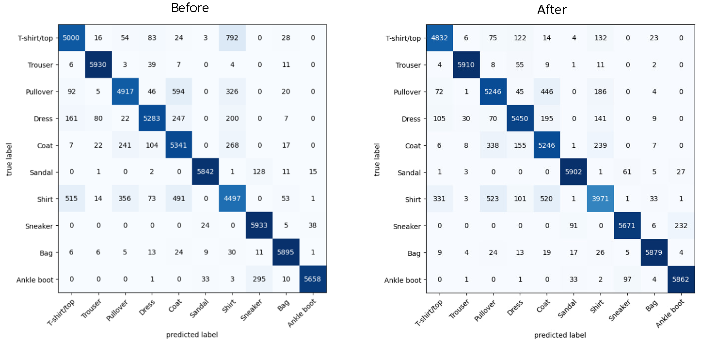

# Confusion Matrix Experiments Documentation

This documentation covers the results of the confusion matrices generated from the FashionMNIST Dataset before and after making some modifications to the training data.

## Aim

The aim is to improve the quality of the training dataset used for model training.

## Methodology

1. A baseline model is trained on all the training data until a desirable accuracy is achieved.
2. A confusion matrix is constructed and inspected to identify any discrepancies, inaccuracies, or misclassifications.
3. These misclassifications are handled in different ways (e.g., removed or swapped labels).
4. A new untrained instance of the model is trained again with the modified dataset.
5. A confusion matrix is constructed to compare the initial training dataset and the training dataset after modifications.

## Code

The code used for these experiments mostly remains the same. For swapping the labels, it is done by modifying the code in the `new folderdataset` class to load the new training dataset (`FolderDataset2`). For removing data, we can simply remove the folder containing the misclassified images using `shutil.rmtree()` before loading the data again.

The code involves an external file `model.pth`, which contains the weights for the first model after being trained with the original dataset. This increases the reproducibility of the experiments, at least for the initial confusion matrix. The file can be found in the GitHub repository along with the code:

[GitHub Repository - Confusion_Matrix_Experiments](https://github.com/Aadharsh1/ML-Deep-Learning/tree/main/Confusion_Matrix_Experiments/FashionMNIST)

## Experiments

### 1. Removing Images from one misclassified folder

- Removing the images labeled as T-shirts but misclassified as shirts.

### 2. Removing Images from both misclassified folders
- Removing both folders where T-shirts were misclassified as shirts and shirts were misclassified as T-shirts.

### 3. Swapping Labels

- Swapping the labels of misclassified T-shirts as shirts to shirts and misclassified shirts as T-shirts to T-shirts, and retraining the model.
  - The labels of 549 T-shirts were reassigned to shirts.
  - The labels of 819 shirts were reassigned to T-shirts.

### 4. Reassigning Labels of One Group

- Only reassigning the labels of one group of misclassified images.
  - The labels of 885 shirts, which were misclassified as T-shirts, were reassigned to T-shirts.

