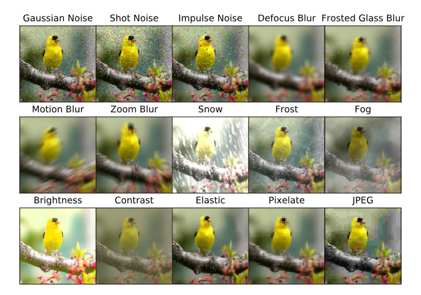
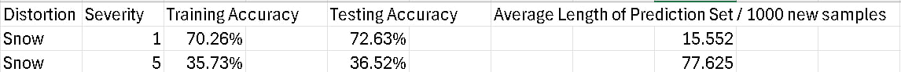
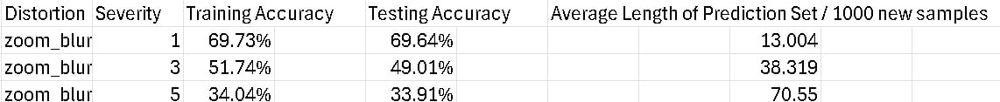
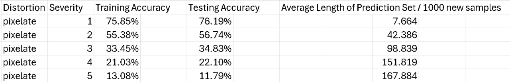
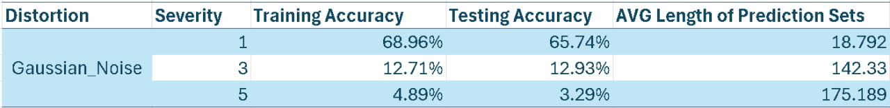
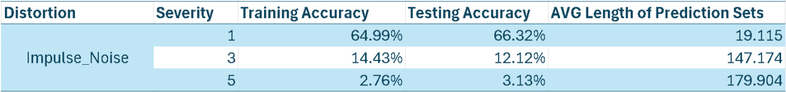
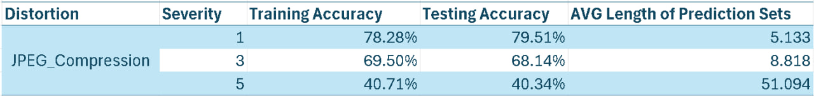

# Experiments on Tiny ImageNet-C

This repository contains experiments conducted on the Tiny ImageNet-C dataset, which consists of images with various distortions at different levels of severity. The goal of these experiments was to evaluate how the training/testing accuracy and the average length of prediction sets, after running conformal prediction, change with the increasing severity of distortions.

## Overview

### Dataset and Distortions

The Tiny ImageNet-C dataset includes multiple types of distortions, each with severity levels ranging from 1 to 5. The distortions evaluated in this experiment include:

- Snow
- Zoom Blur
- Pixelate
- Gaussian Noise
- Impulse Noise
- JPEG Compression

### General Types of Distortions

### Methodology

1. **Baseline Model**: A baseline model was trained on the original Tiny ImageNet dataset.
2. **Evaluation**: The model's training/testing accuracy and the average length of prediction sets were evaluated using conformal prediction.
3. **Severity Analysis**: The experiments were conducted to observe how the metrics change with the increasing severity of distortions.

### Code and Notebooks

The code and detailed implementation can be found in the following Jupyter Notebook:
- [Experiments on Tiny ImageNet-C](https://github.com/Aadharsh1/ML-Deep-Learning/blob/main/Corrupted_Images_Example/Tiny_Imagenet_C/tiny_imagenet_C%20.ipynb)

## Experiments

### Snow Distortion

**Description**: Evaluation on the Tiny ImageNet-C dataset with snow distortion at varying severity levels.

### Zoom Blur Distortion

**Description**: Evaluation on the Tiny ImageNet-C dataset with zoom blur distortion at varying severity levels.

### Pixelate Distortion

**Description**: Evaluation on the Tiny ImageNet-C dataset with pixelate distortion at varying severity levels.

### Gaussian Noise Distortion

**Description**: Evaluation on the Tiny ImageNet-C dataset with Gaussian noise distortion at varying severity levels.

### Impulse Noise Distortion

**Description**: Evaluation on the Tiny ImageNet-C dataset with impulse noise distortion at varying severity levels.

### JPEG Compression Distortion

**Description**: Evaluation on the Tiny ImageNet-C dataset with JPEG compression distortion at varying severity levels.

## Conclusion

The experiments demonstrate the impact of various distortions at different severity levels on the performance of the baseline model. The results highlight how the training/testing accuracy and the average length of prediction sets are affected as the severity of distortions increases.

